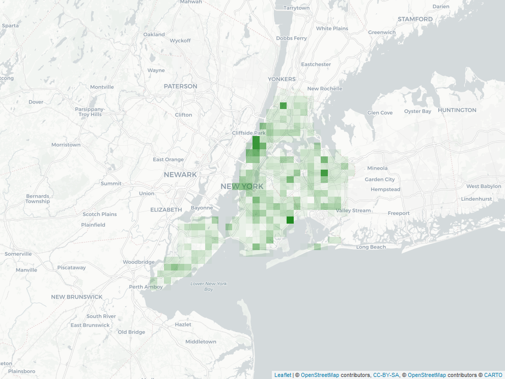

<!-- README.md is generated from README.Rmd. Please edit that file -->

```{r, include = FALSE}
knitr::opts_chunk$set(
  collapse = TRUE,
  comment = "#>"
)
```

# README

<!-- badges: start -->
[](https://doi.org/10.5281/zenodo.4908847)

[](https://www.tidyverse.org/lifecycle/#stable)  

[](https://mybinder.org/v2/gh/libjohn/casestudy_bigquery_dbplyr/master?urlpath=rstudio)
<!-- badges: end -->

_R case study: public datasets in Google BigQuery using DBplyr_

Building on earlier [Rfun](https://rfun.library.duke.edu/) workshops, exploit your knowledge of familar Tidyverse syntax to query remote databases via RStudio. Attendees will be introduced to the dBplyr package as an alternative to SQL database querying. Following a review of dplyr and an overview of Google BigQuery public datasets, attendees will practice querying Google BigQuery public data.  

Prerequisites: 

- Introductory familiarity with R and the Tidyverse (e.g. [quickStart with R](https://rfun.library.duke.edu/portfolio/r_flipped/))
- Use Google [BigQuery public datasets](https://cloud.google.com/bigquery/public-data)   
- Install R and RStudio on your computer
- tidyverese, DBI, dbplyr, bigrquery installed in your R environment

```r
install.packages(c("tidyverse", "DBI", "dbplyr", "bigrquery"))
```

## Resources

- [Databases using R](https://db.rstudio.com/)
- [library(DBI)](https://dbi.r-dbi.org/reference/)
- [library(bigrquery)](https://bigrquery.r-dbi.org/)
- [library(dbplyr)](https://dbplyr.tidyverse.org/)
- [RStudio Conf 2019](https://rstudio.com/resources/rstudioconf-2019/databases-using-r-the-latest/) (15 min. video)


### Google Cloud Platform & BigQuery

Get a Google Cloud account

- [BigQuery sandbox](https://cloud.google.com/bigquery/docs/sandbox)  **getting started**
- [Google Cloud Platform free tier](https://cloud.google.com/free/docs/gcp-free-tier)
- [BigQuery public datasets](https://cloud.google.com/bigquery/public-data)
- [BigQuery](https://cloud.google.com/bigquery)
- [GCP-BigQuery **Console**](https://console.cloud.google.com/bigquery)




## License
John Little  
https://JohnLittle.info  
https://Rfun.library.duke.edu  
https://library.duke.edu/data  

CC BY-NC  
Creative Commons Attribution-NonCommercial  
https://creativecommons.org/licenses/by-nc/4.0  
